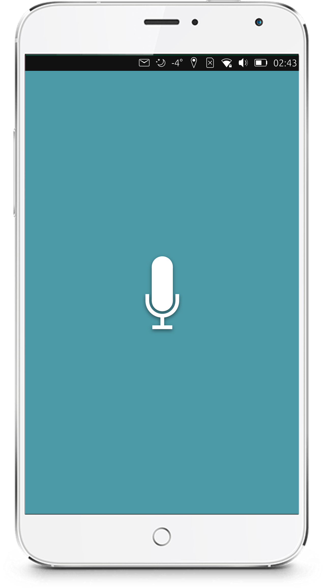
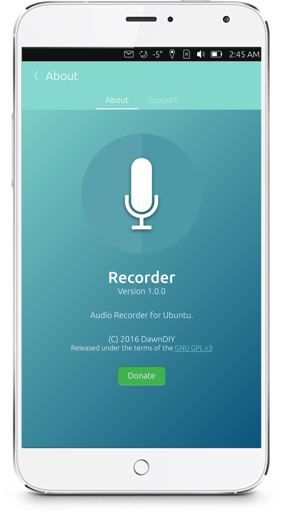
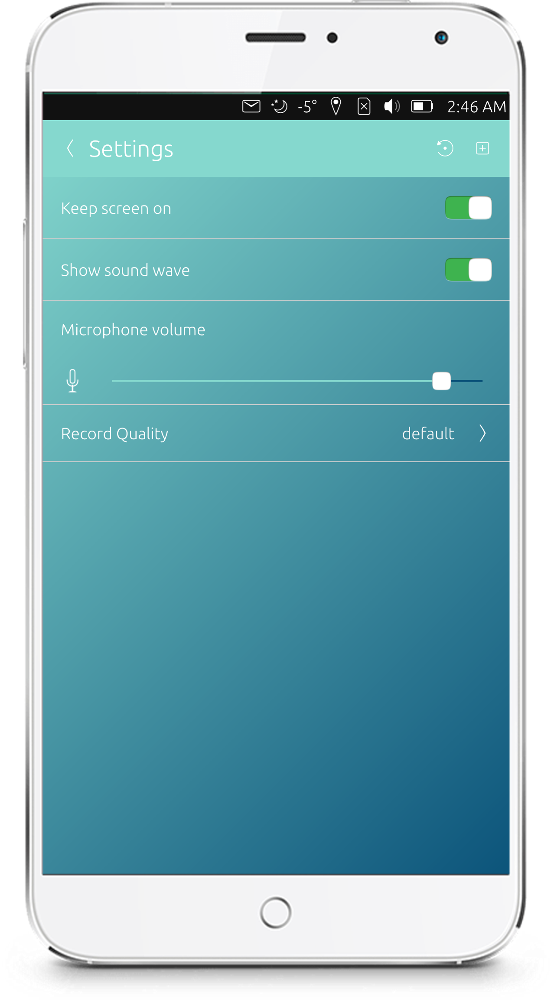
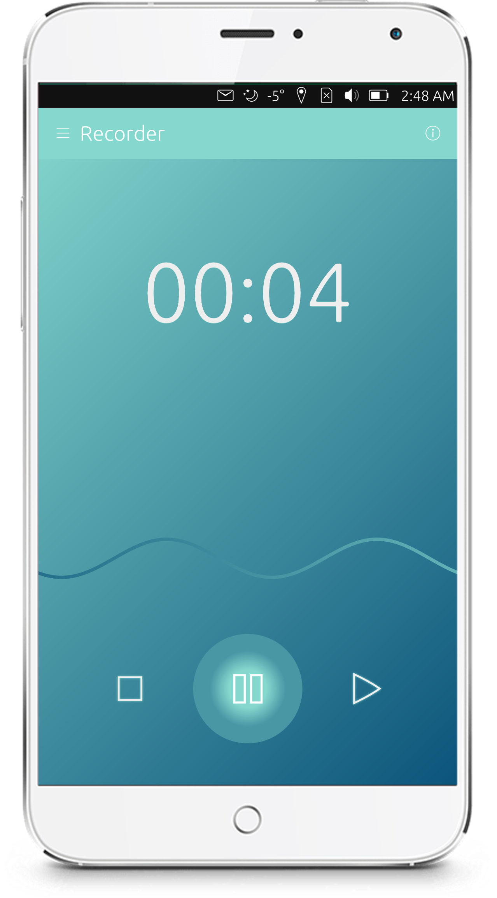

# Recorder

A beautiful audio recorder for Ubuntu Touch.

## Screenshots

## Features

- Live volume level analyzer
- Multiple audio codecs support
- Multiple encoding mode
- Microphone volume control
- Easy to play records in record list
- Easy to export record to email, file explorer, etc.

## License

Copyright (C) 2016  [DawnDIY](http://dawndiy.com/)

This program is free software: you can redistribute it and/or modify
it under the terms of the GNU General Public License as published by
the Free Software Foundation, either version 3 of the License, or
(at your option) any later version.

This program is distributed in the hope that it will be useful,
but WITHOUT ANY WARRANTY; without even the implied warranty of
MERCHANTABILITY or FITNESS FOR A PARTICULAR PURPOSE.  See the
GNU General Public License for more details.

You should have received a copy of the GNU General Public License
along with this program.  If not, see <http://www.gnu.org/licenses/>.
